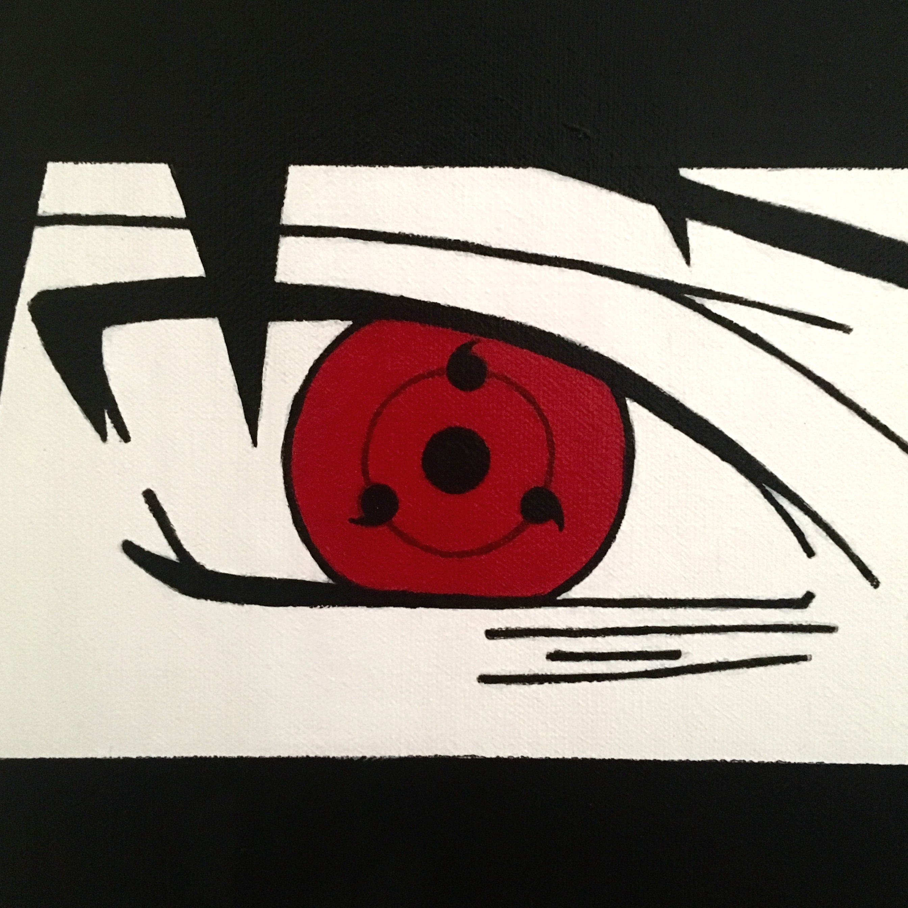
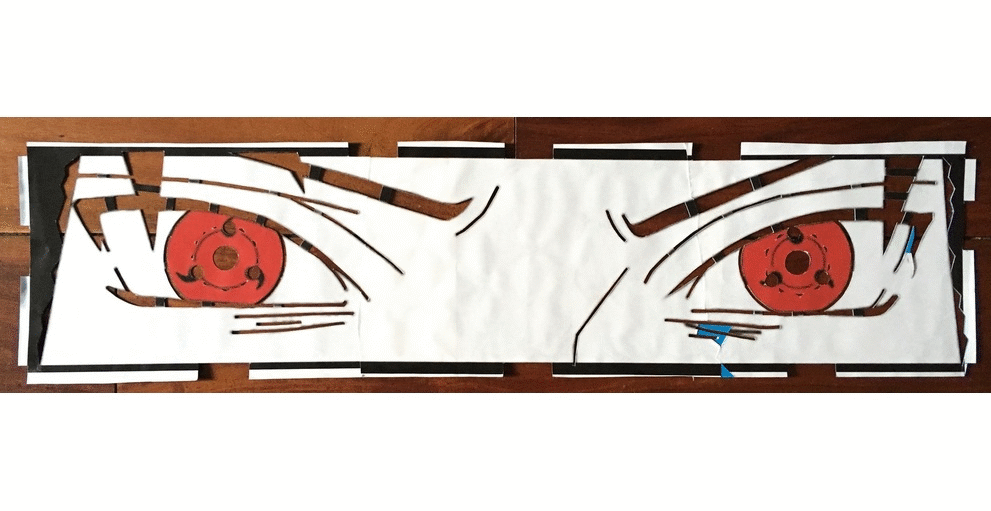

I watched a Naruto marathon a few months ago, so I was destined to make some fanart eventually. <!-- more --> I recently found myself in-between jobs, so the opportunity to make art presented itself. When life gives you chakras, make jutsus.

## Materials/media

1. Poster board
1. X-acto knife
1. Canvas
1. Acrylic paint

## The Process

1. Make stencil using printed manga panels
1. Put down paint using the stencil
1. Clean up the messy stencil job, refine details
1. Fill in the eyes
1. Clean up mistakes
1. Varnish (2 to 3 coats)

