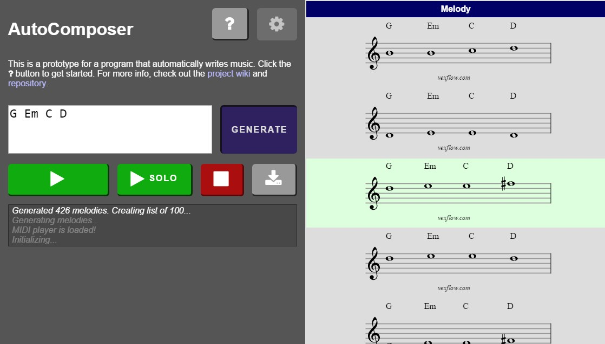
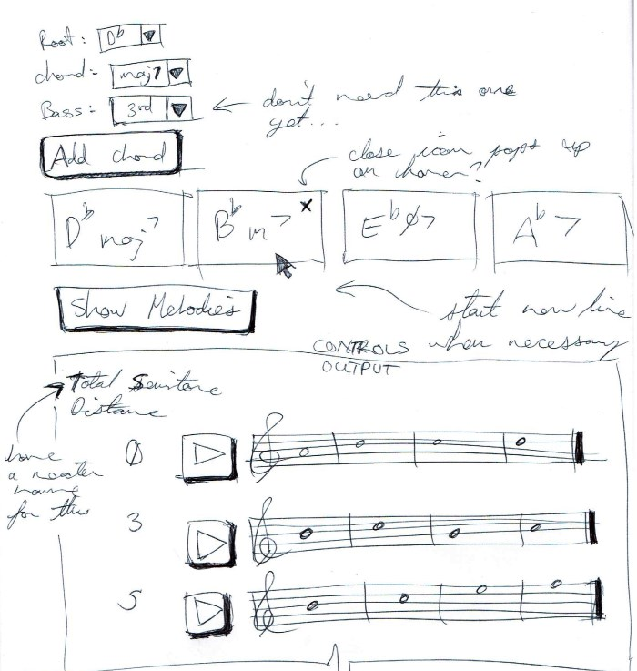
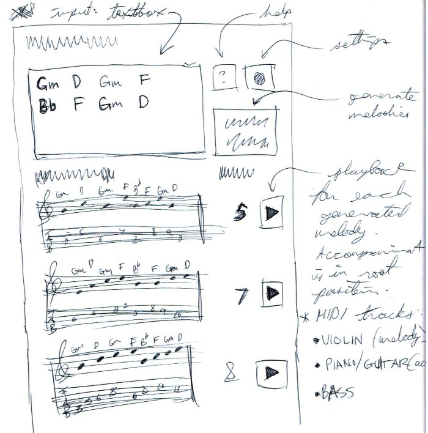

Web app that automagically writes music! <!-- more -->

I had a few requirements in mind when building this:

- generating melodies based on a given chord progression
- playing back those generated melodies to users
- downloading the melody (and accompaniment) as a MIDI file, for future playback or tinkering

Maybe it'd be a useful tool for exploring different ways to move through a chord progression. Or for brainstorming when writing a musical composition.

For more info, check out the [project wiki](https://github.com/rjsalvadorr/autocomposer-js/wiki) and [repository](https://github.com/rjsalvadorr/autocomposer-js).

## Tech used

- *React* and *Browserify* for bundling the HTML/JS
- *Mocha* for unit testing. *ESDoc* for generating documentation
- *Stylus* for CSS processing.

## Game plan

I've always wanted to make software that did stuff with music in some way. That led me to play with JS libraries out there that can handle music theory, playback, and notation. Slowly, I started to think of ways to tie this all together to build an automatic music composer.

## Pulling it off

Thankfully, I was at a point where I could do something with my coding skills and music theory knowledge. I started to see music theory can be seen as a set of _design patterns_ or _best practices_ followed by musicians and composers for the last few centuries. As those musicians kept encountering musical problems, they developed techniques to solve them, and passed those techniques down to their apprentices.

The way I saw it, I could embed those musical rules into a piece of software, and it should produce sounds that weren't _too_ horrible. For this version of the AutoComposer, I modelled the following musical concepts in code:

### Chords and Notes

Musical chords are commonly defined as a set of notes being played together. There are many types of chords out there, and each one specifies the notes that musicians will choose in order to play a chord. For example, _G major_ consists of the notes _G_, _B_, and _D_. There are other principles which determine the exact order and range to be played. But generally, when a musician wants to play a _G major_ chord, the audience will hear the notes _G_, _B_, and _D_.

### Harmonization

In most musical situations, melodies are rarely played on their own. Even when an instrument takes a solo, the band continues playing. Now, as a melody rises and falls in pitch, the exact notes in the melody usually _harmonize_ with the chord that's currently being played by the band. So if the band is playing _G major_ chord and our melody is playing a _G_, _B_, or _D_, those two sides are _in harmony_.

### Melody Generation

The easiest way to create a smooth melody that sounds good when played with chords is to simply choose from the _chord tones_ of each chord. For the initial stage of melody generation, the AutoComposer simply chooses which chord tones are available for each chord, and connects them together. Then it filters them out by a few criteria.

## Results

The AutoComposer is doing exactly what I want it to do. And it turns out that modern Javascript is really fun to play with! Although I have a lot more in mind for the AutoComposer, and a web browser might not be the best environment for those future plans. I may expand the music generation code and have it run on a proper web server so I can do more complicated (and exciting) things with music and code.

_UPDATE:_ I ended up building the [mecha-muse](https://quizzical-carson-84be05.netlify.com/) as the successor to this project.