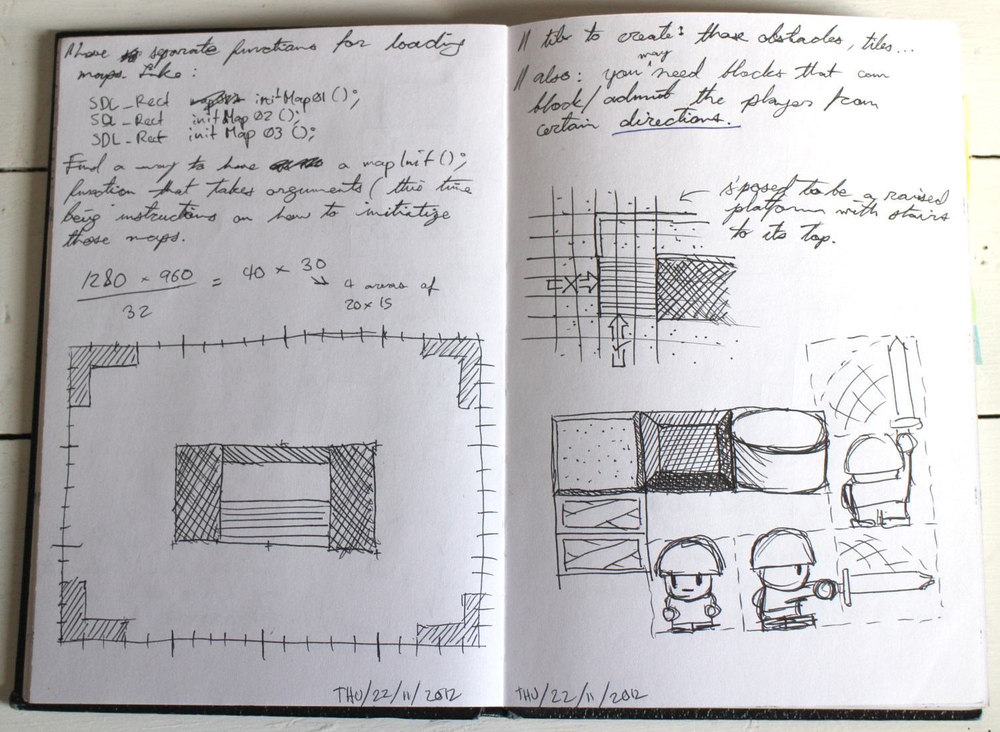
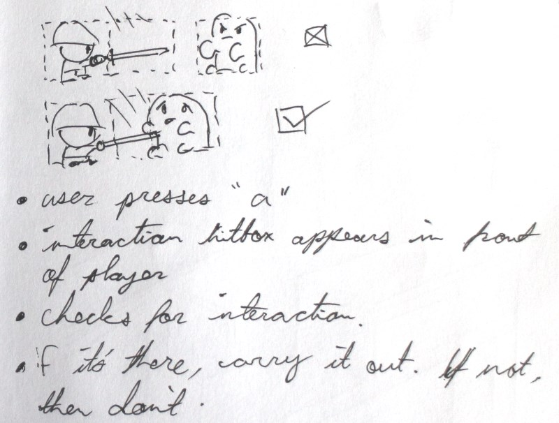
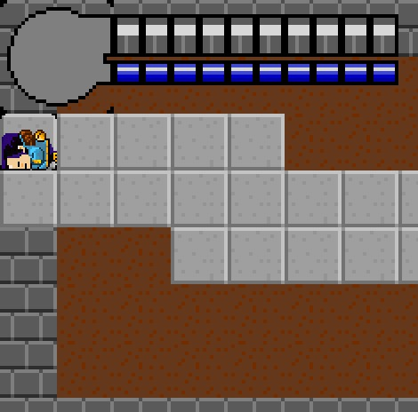
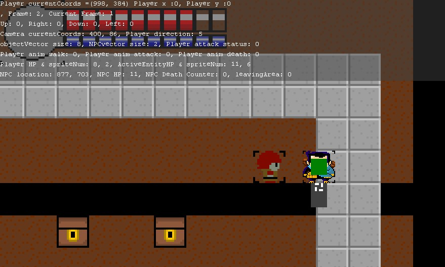
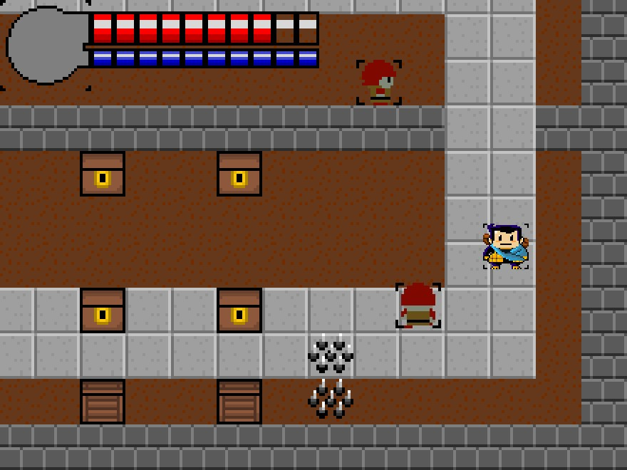
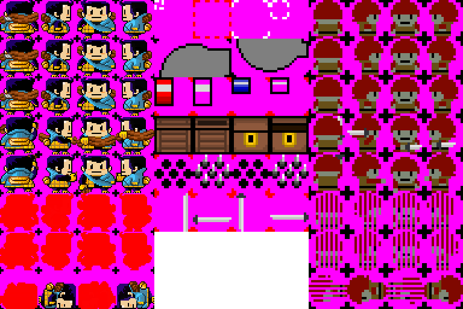

Two brothers tried to make a Zelda-esque platformer, and they caught a glimpse of development hell.

<!-- more -->

Sometime around winter 2012, I used my new-found C++ skills to make a simple 2D game, like the Nintendo classics.
It was eventually called BroQuest 'cause my brother Mike offered to help with his art skills.

### Game plan

The game had to blend together:

+ **User control**. This thing has to respond to inputs from the user, from the mouse and keyboard
+ **In-game space**. Each entity exists in that space, and the engine will move entities and control interactions between them and the world
+ **Camera system**. We want a game world that's larger than one screen.
So we need a way to show only relevant events around the player
+ **Graphics**. Each object needs graphics to be shown on the screen.
If an object has different states, or can be seen from multiple angles, we needed more graphics for it.
And also if we have different types of terrain

No problem, that's gonna be easy. I'm a software magician now.

### Pulling it off

It wasn't easy. If I was a software magician then, I was a very inept one.

I ended up writing a game engine from scratch with [*SDL*](https://www.libsdl.org/), a C++ library for controlling graphics/audio.
I walked through a tutorial, and gradually learned how to assemble all of those elements together:

1. Game engine!
1. Co-ordinate/map grid system
1. Basic animation through sprites
1. Controls to let the player move and interact with world by opening things and slaying NPCs
1. Primitive AI. Yeah, all these guys do is move towards my character in a straight line and attack if I'm close enough. But they're doing these things without player commands!

### End of Experiment

Unfortunately, we stopped working on this when the summer ended and we just got busy with life.
I went back to school, and my brother got a bit more busy at work.

I learned how much effort it took to build a good game.
Hell, building a _playable_ game feels like it's an achievement in itself.
All of this gave me tons of respect for serious game devs.

Game dev'ing is really fun stuff though. It felt like Bob Ross's feelings about the canvas:

> See how you can move things around? You have unlimited power on this canvas -- can literally, literally move mountains
