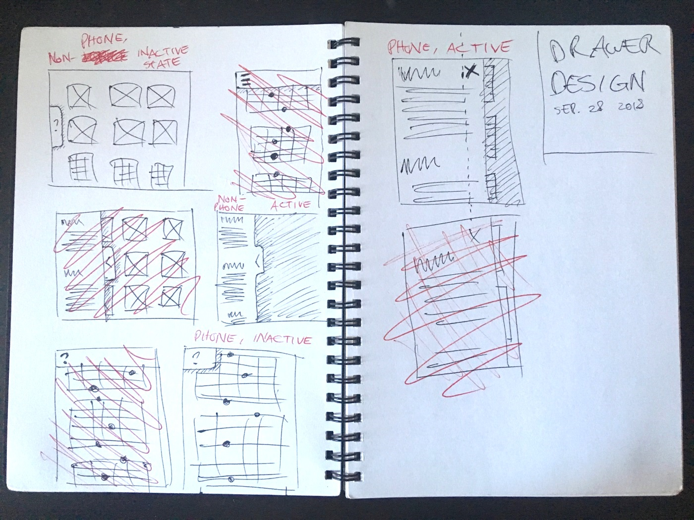
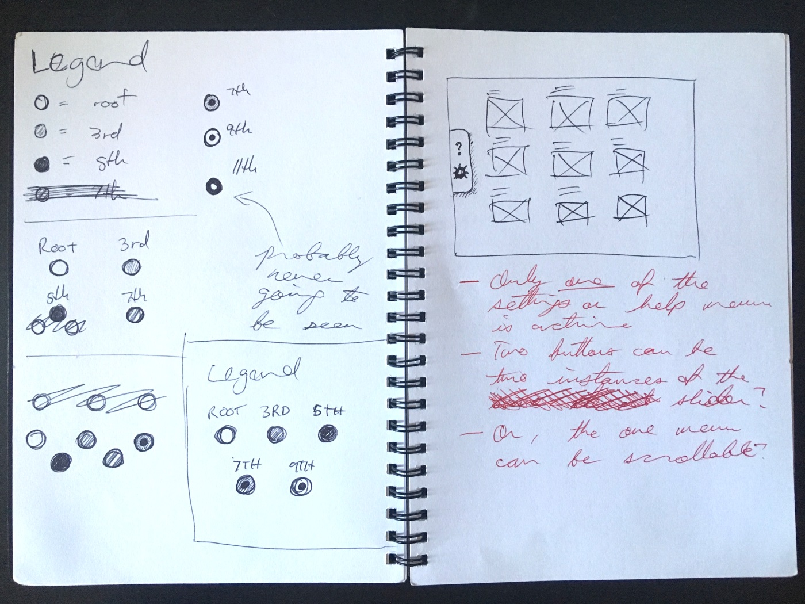
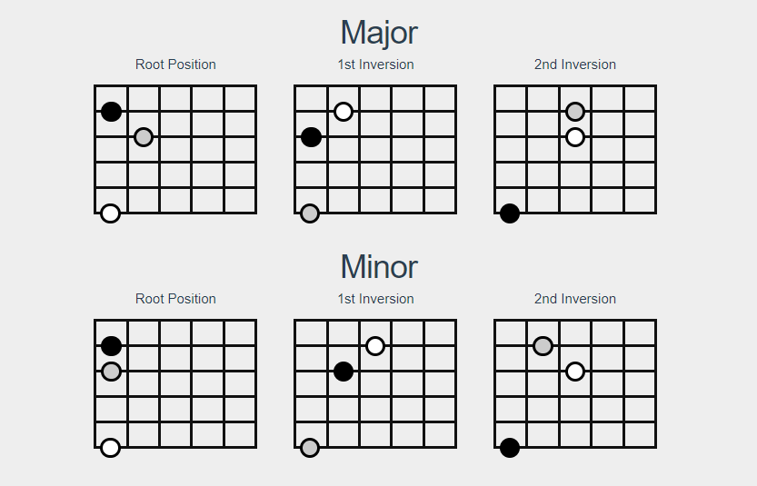

Earlier this year, I was studying chord patterns and wrote them into a document.
This was a PITA to update, so I made an app out of it.

<!-- more -->

I took this opportunity to learn some tech, so I decided to jump on the Vue bandwagon for it.
I found that the [Vue CLI tools](https://cli.vuejs.org/guide/creating-a-project.html) didn't get in my way at all,
and the Vue documentation made for a gentle learning curve.

## Process

With this project, I needed to figure out two things, and all the hard stuff was finished in one afternoon:

1. Data format for the chord diagrams. I laid it out in a few JSON files here.
1. Vue component scheme. I settled for four components here:
  + ChordGroup
  + FretboardDiagram
  + FretboardMarker
  + PatternGroup

For someone already familiar with web dev frameworks and the Node stack, the view from Vue is majestic.

For more info, check out the project repository at [github.com/rjsalvadorr/guitarragrams](https://github.com/rjsalvadorr/guitarragrams)

## Sketches / old versions

