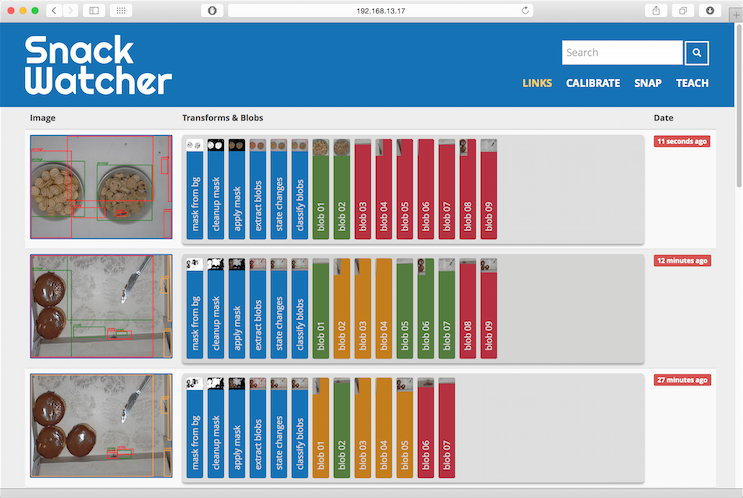
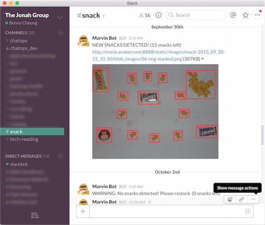

Sometime in late 2015/early 2016, I was involved in a SnackWatcher project at the Jonah Group. This was a fun exercise involving a sweet office tradition.

<!-- more -->

## Hardware used

- *Raspberry Pi 2*. One for development, and another for deployment
- Spare monitors, for shielding the camera from glare

## Software used

A whole bunch of Python libraries/frameworks:

- [*OpenCV*](http://opencv.org/) and [*SimpleCV*](http://simplecv.org/) for image recognition.
- [*Orange*](https://orange.biolab.si/) machine learning tools.
- [*Flask*](http://flask.pocoo.org/) and *Jinja* were used for displaying data to the web.
- A [*Hubot*](https://hubot.github.com/) gave our team automatic updates via Slack.

## Overview

When our colleagues wanted to share snacks, they would place it on a _snack table_, so fellow devs can enjoy some treats. The project's premise was to install a camera over the snack table, and automatically alert our colleagues whenever a snack was deployed.

Upon joining the SnackWatcher team, I worked on the user-facing parts of the system. First, I set up a Slack bot to let our colleagues know when there are new snacks. This bot periodically checked the table status (using the handy SnackWatcher API). I also implemented a webpage using *Flask*, a Python static site generator.

### More links

If you want some more details, feel free to check out the [GitHub repo](https://github.com/jonahgroup/SnackWatcher) and [blog](https://jonahgroup.github.io/SnackWatcher/) for the project.
