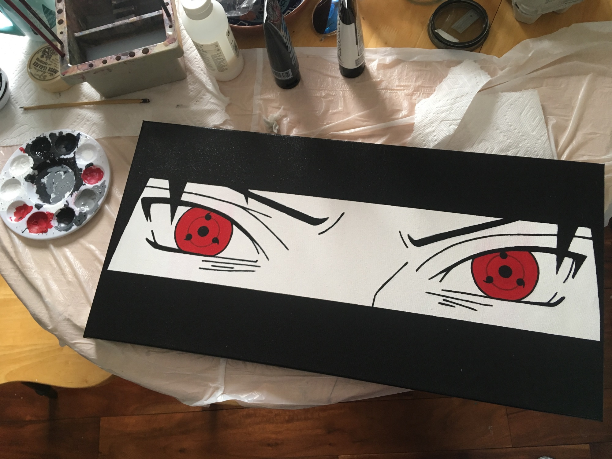

Process shots for the Sharingan project  <!-- more --> ([see here](../sharingan/)).

## Materials/media

1. Poster board
1. X-acto knife
1. Canvas
1. Acrylic paint

## The Process

1. Make stencil using printed manga panels
1. Put down paint using the stencil
1. Clean up the messy stencil job, refine details
1. Fill in the eyes
1. Clean up mistakes
1. Varnish (2 to 3 coats)

## Shots

